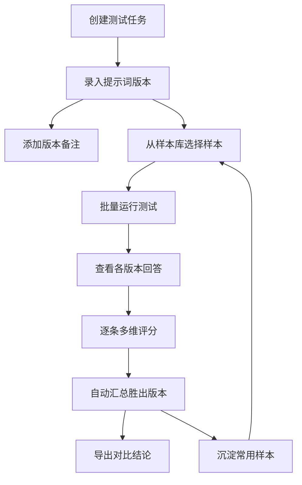

## 1. 产品概述

提示词 A/B 实验平台，面向电商客服和营销人员，帮助他们系统化地验证不同提示词版本在真实业务场景下的表现差异，通过批量测试、多维度评分和自动汇总，避免团队反复试错，沉淀最优提示词方案。

- 核心价值：用数据和实验替代主观判断，让提示词选型从"凭感觉"变为"看数据"
- 目标用户：电商客服团队、营销运营人员、AI 提示词工程师

## 2. 核心功能

### 2.1 用户角色

| 角色 | 注册方式 | 核心权限 |
|------|----------|----------|
| 团队成员 | 邮箱注册 | 创建任务、编辑提示词、执行测试、查看评分 |
| 团队管理员 | 邀请加入 | 以上权限 + 管理样本库、导出报告、删除任务 |

### 2.2 功能模块

1. **任务看板页**：任务列表、状态筛选、快速创建任务入口
2. **提示词编辑页**：录入/编辑多版本提示词、版本备注、变量高亮
3. **批量测试页**：选择样本、批量运行、实时查看各版本回答
4. **评分统计页**：多维度打分、自动汇总胜出版本、可视化对比
5. **样本库页**：管理商品介绍/售后问答/活动文案等样本、分类标签、收藏常用样本

### 2.3 页面详情

| 页面名称 | 模块名称 | 功能描述 |
|----------|----------|----------|
| 任务看板 | 任务列表卡片 | 展示所有测试任务，含状态标签（待测试/测试中/已完成）、创建时间、提示词版本数 |
| 任务看板 | 筛选与搜索 | 按状态筛选、关键词搜索、排序方式切换 |
| 任务看板 | 快速创建 | 点击创建新任务，填写任务名称、场景类型、备注 |
| 提示词编辑 | 版本列表 | 展示当前任务下所有提示词版本，含版本号、备注、最后编辑时间 |
| 提示词编辑 | 编辑区 | 多行文本编辑，支持变量插入（如{{商品名}}），字数统计 |
| 提示词编辑 | 版本对比 | 左右对照两个版本的差异 |
| 批量测试 | 样本选择 | 从样本库勾选测试样本，按分类筛选 |
| 批量测试 | 运行控制 | 一键批量运行、暂停、重跑单条 |
| 批量测试 | 结果预览 | 并排展示每个提示词版本对同一样本的回答，实时流式显示 |
| 评分统计 | 评分面板 | 对每个回答按准确性（1-5）、语气（1-5）、可用性（1-5）打分 |
| 评分统计 | 自动汇总 | 计算各版本综合得分，高亮胜出版本，显示得分雷达图 |
| 评分统计 | 导出报告 | 导出对比结论为 PDF/图片 |
| 样本库 | 分类管理 | 按商品介绍、售后问答、活动文案等分类浏览 |
| 样本库 | 样本CRUD | 新增/编辑/删除样本，支持批量导入 |
| 样本库 | 收藏与标签 | 收藏常用样本，添加自定义标签 |

## 3. 核心流程

用户创建测试任务 → 录入多个提示词版本（添加版本备注） → 从样本库选择测试样本 → 批量运行测试 → 查看各版本回答 → 逐条评分（准确性/语气/可用性） → 系统自动汇总胜出版本 → 导出对比结论 → 沉淀常用样本

## 4. 用户界面设计

### 4.1 设计风格

- **主色调**：深邃靛蓝（#1E293B）为主色，搭配琥珀橙（#F59E0B）作为强调色，营造专业实验感
- **辅助色**：薄荷绿（#10B981）表示通过/胜出，珊瑚红（#EF4444）表示失败/低分
- **按钮风格**：圆角微弧（8px），填充按钮为主，幽灵按钮为辅
- **字体**：标题用 Noto Sans SC Bold，正文用 Noto Sans SC Regular，数据用 JetBrains Mono
- **布局风格**：左侧固定导航栏 + 右侧内容区，卡片式内容组织
- **图标风格**：线性图标（Lucide 风格），2px 描边

### 4.2 页面设计概览

| 页面名称 | 模块名称 | UI 元素 |
|----------|----------|---------|
| 任务看板 | 任务列表卡片 | 深色卡片、状态色条、悬停上浮动画 |
| 任务看板 | 筛选栏 | 胶囊式筛选标签、搜索输入框 |
| 提示词编辑 | 编辑区 | 深色代码编辑风格、变量高亮着色、行号 |
| 批量测试 | 结果预览 | 多列并排布局、流式打字效果、差异高亮 |
| 评分统计 | 雷达图 | 三维雷达图、胜出版本金色描边 |
| 样本库 | 样本卡片 | 分类色条、标签药丸、收藏星标 |

### 4.3 响应式设计

- 桌面优先设计，最小宽度 1024px
- 平板端（768-1024px）侧边栏折叠为图标模式
- 移动端（<768px）底部标签栏导航，卡片单列排列

### 4.4 3D 场景

不适用
