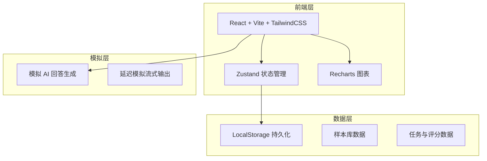
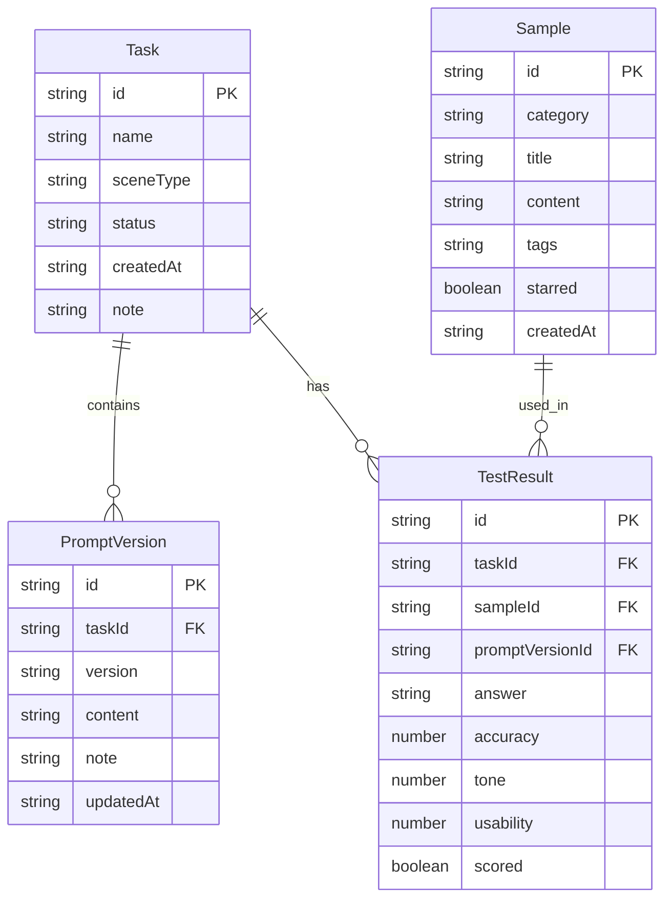

## 1. 架构设计



## 2. 技术说明

- **前端**：React@18 + TailwindCSS@3 + Vite
- **初始化工具**：Vite
- **状态管理**：Zustand（轻量级，适合单页应用）
- **图表库**：Recharts（雷达图、柱状图）
- **后端**：无（纯前端应用，数据存储在 LocalStorage）
- **数据库**：无（使用 LocalStorage 模拟持久化）
- **AI 模拟**：前端模拟生成回答，支持流式输出效果

## 3. 路由定义

| 路由 | 用途 |
|------|------|
| / | 任务看板，展示所有测试任务 |
| /task/:id/prompts | 提示词编辑页，管理任务的提示词版本 |
| /task/:id/test | 批量测试页，选择样本并运行测试 |
| /task/:id/results | 评分统计页，查看结果和评分 |
| /samples | 样本库页，管理和浏览测试样本 |

## 4. API 定义

无后端 API，所有数据通过 Zustand store + LocalStorage 管理。

### 核心数据操作

```typescript
interface Task {
  id: string
  name: string
  sceneType: 'product_intro' | 'after_sale' | 'campaign_copy'
  status: 'pending' | 'testing' | 'completed'
  createdAt: string
  note: string
}

interface PromptVersion {
  id: string
  taskId: string
  version: string
  content: string
  note: string
  updatedAt: string
}

interface Sample {
  id: string
  category: 'product_intro' | 'after_sale' | 'campaign_copy'
  title: string
  content: string
  tags: string[]
  starred: boolean
  createdAt: string
}

interface TestResult {
  id: string
  taskId: string
  sampleId: string
  promptVersionId: string
  answer: string
  scores: { accuracy: number; tone: number; usability: number }
  scored: boolean
}
```

## 5. 服务端架构

不适用（纯前端应用）

## 6. 数据模型

### 6.1 数据模型定义



### 6.2 数据定义

使用 LocalStorage 存储，初始化时预置一组电商场景样本数据：

- 商品介绍样本 3 条（手机、护肤品、家电）
- 售后问答样本 3 条（退换货、物流查询、质量问题）
- 活动文案样本 3 条（618大促、新品首发、会员日）
